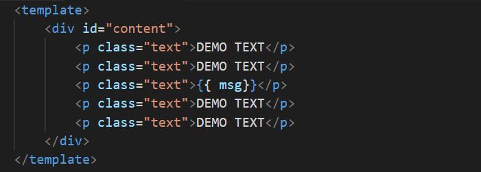
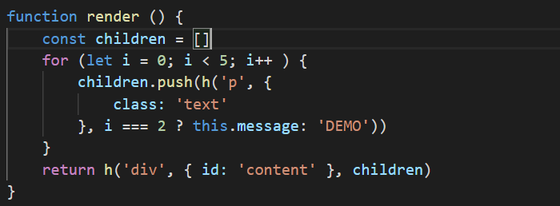

title: Vue3.0知识分享
speaker: 林佳炜
prismTheme: solarizedlight
plugins:
    - echarts

<slide class="bg-black-blue aligncenter" image="https://source.unsplash.com/C1HhAQrbykQ/ .dark">

# Vue3.0知识分享 {.text-landing.text-shadow}

By 林佳炜 {.text-intro}

<!-- [:fa-github: Github](https://github.com/lin559){.button.ghost} -->

<slide class="bg-black-blue aligncenter" image="https://source.unsplash.com/C1HhAQrbykQ/ .dark">

# 关于Vue3.0的一些更新

----

- ## 更小
- ## 更快
- ## 加强TypeScript
- ## 加强API设计一致性
- ## 提供自身可维护性
- ## 开放更多底层功能


<slide class="bg-black-blue aligncenter" image="https://source.unsplash.com/C1HhAQrbykQ/ .dark">

# 为了更快而做出的改动

----

- ### Object.defineProperty --> Proxy
- ### Virtual DOM 重构

<note style="color:black">- 更多编译时优化
    - slot默认编译为函数
    - Monomorphic vnode factory
    - Compiler-geneated flags for vnode/children types</note>


<slide class="bg-black-blue aligncenter" image="https://source.unsplash.com/C1HhAQrbykQ/ .dark">


<!-- 其实在今年年初的时候proxy的版本已经做好，但是并没有发布，因为现在IE11并不能够使用proxy即使发布了可能还是得用2.x的版本 -->
# 数据绑定
----
- ## 发布者-订阅者模式
- ## 脏值检查
- ## 数据劫持
----
`Vue的双向数据绑定采用的是 发布者-订阅者模式 + 数据劫持`

<slide class="bg-black-blue aligncenter" image="https://source.unsplash.com/C1HhAQrbykQ/ .dark">
## [来看看官方说明](https://cn.vuejs.org/v2/guide/list.html#注意事项)


<slide class="bg-black-blue aligncenter" image="https://source.unsplash.com/C1HhAQrbykQ/ .dark">

# 对vdom的优化
----


#### vue的template中，我们能够很容易找到动态节点的部分，针对动态节点的部分进行调整。

<slide class="bg-black-blue aligncenter" image="https://source.unsplash.com/C1HhAQrbykQ/ .dark">

# 对vdom的优化
----


#### 在react的render function中，要找到动态节点似乎就没有那么简单了

<note style="color:black">传统vdom性能跟模板大小相关，跟动态节点的数量是无关的，因为当动态节点发生改变的时候，会对整个模板组件进行遍历，其实这是一种性能上的浪费。2.在优化的时候，将vue的vdom和react进行对比，react偏向于render function，vue则是用模板的形式表示，两者代码进行对比的时候，Vue的template能够很容易的找到动态节点的部分，至少是代码呈现在眼前的时候是能够明细那看出需要改进的地方。3.对template进行分析，外部节点结构不发生变化，内部节点
v-if / v-for
将模板基于包含结构性指令的节点进行分割为嵌套的区块
每个区块的内部的节点结构是固定的
每个区块只需要以一个Array追踪自身包含的动态节点4.新策略将vdom更新性能与模板大小相关转变为与模板中动态节点内容的数量相关，得到性能上的提升。
</note>

<slide class="bg-black-blue aligncenter" image="https://source.unsplash.com/C1HhAQrbykQ/ .dark">


```js
// 由Object.defineProperty改为Proxy进行检测数据
// 我不知道大家对之前如何进行监听数据有没有了解过。
Object.defineProperty
```
<slide class="bg-black-blue aligncenter" image="https://source.unsplash.com/C1HhAQrbykQ/ .dark">

# Function-based API

----

- 更好的TypeScript类型推导支持
- 更灵活的逻辑复用能力
- Tree-shaking友好
- 代码更容易别压缩

<note style="color:black">API中的每个函数都是单独引入的，对tree-shaking友好，没有使用到的API的相关代码在打包时会被移除，同时函数API缩写的代码相比对象和class的属性方法，拥有更好的压缩效率</note>
<slide class="bg-black-blue aligncenter" image="https://source.unsplash.com/C1HhAQrbykQ/ .dark">